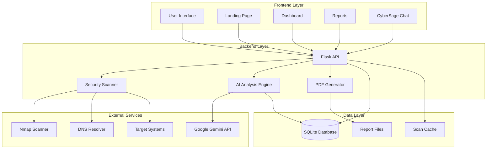
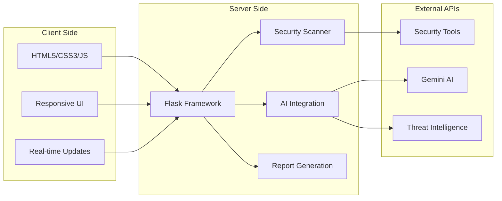
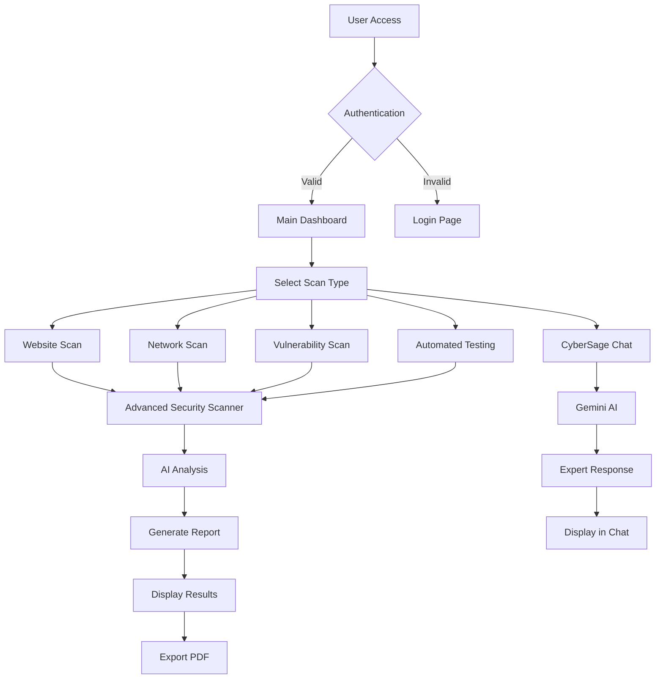
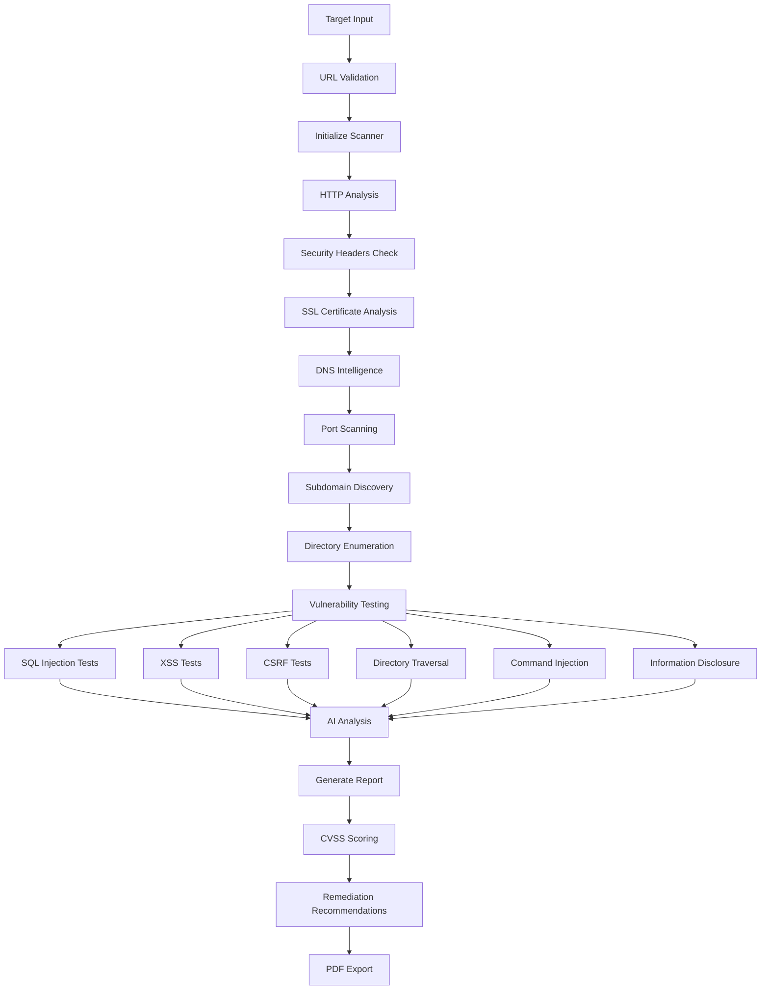
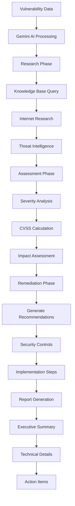
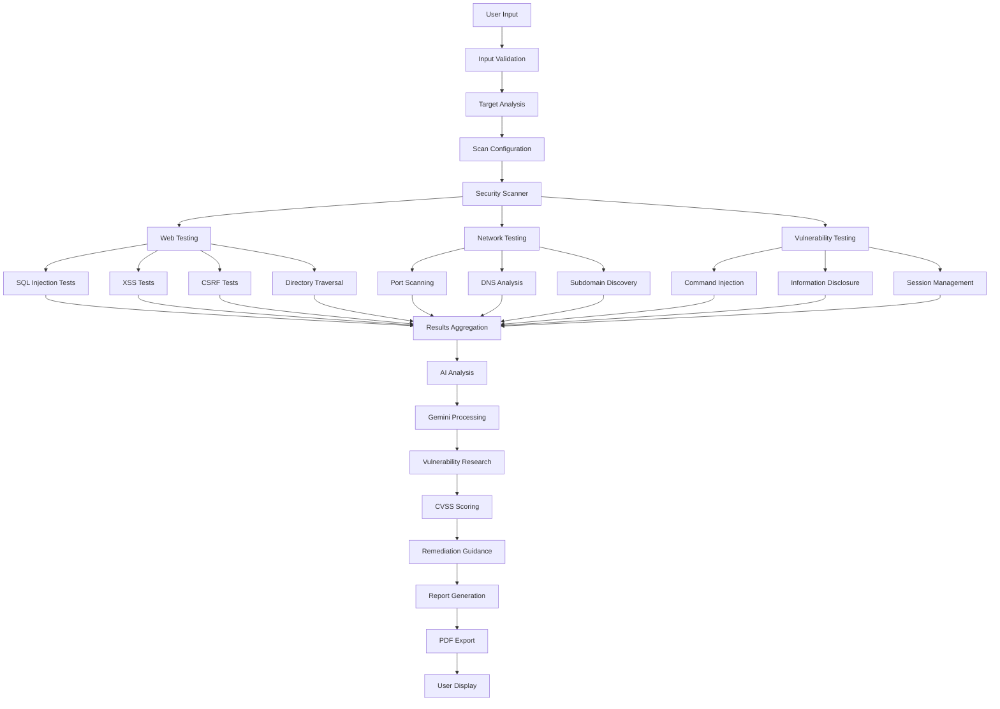
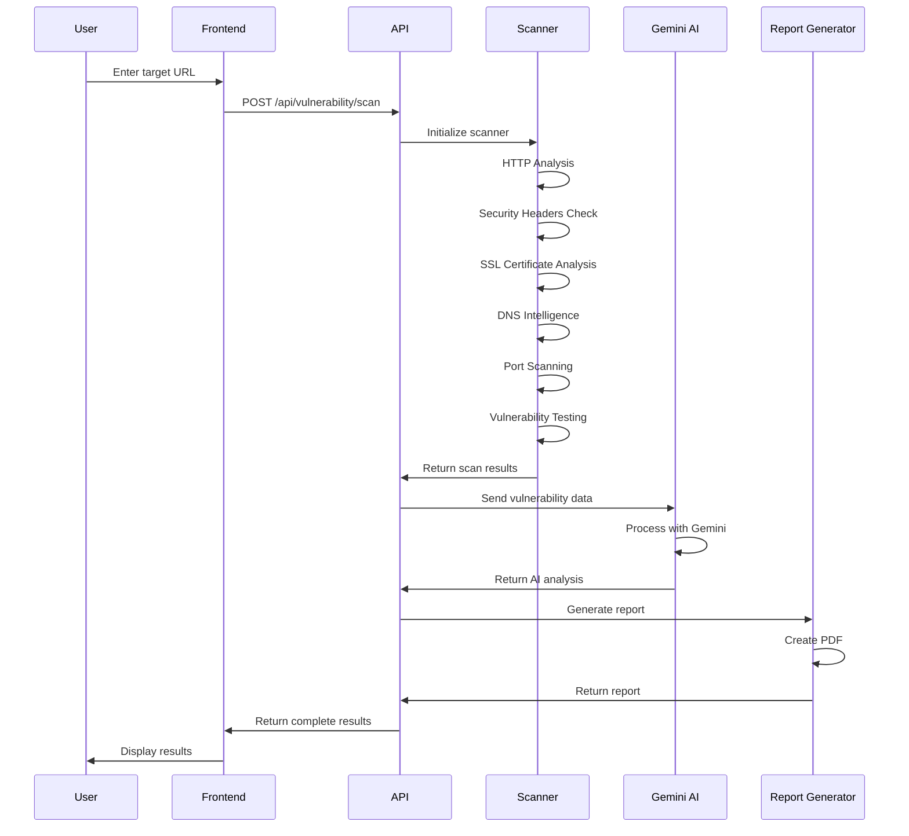
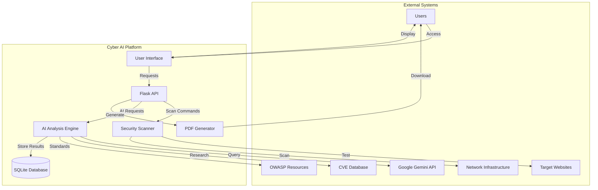

# 🛡️ Cyber AI - Advanced Penetration Testing Platform

[](https://python.org)
[](https://flask.palletsprojects.com)
[](https://ai.google.dev)
[](LICENSE)

## 📋 Table of Contents

- [Overview](#overview)
- [Features](#features)
- [Architecture](#architecture)
- [System Flow Diagrams](#system-flow-diagrams)
- [Context Diagram](#context-diagram)
- [Test Cases](#test-cases)
- [Installation](#installation)
- [Configuration](#configuration)
- [Usage](#usage)
- [API Documentation](#api-documentation)
- [Screenshots](#screenshots)
- [Contributing](#contributing)
- [License](#license)

## 🎯 Overview

Cyber AI is a comprehensive penetration testing platform that leverages artificial intelligence to automate vulnerability assessment, security testing, and penetration testing workflows. Built with Flask and powered by Google's Gemini AI, it provides real-time security analysis, automated testing, and professional reporting capabilities.

### Key Capabilities

- **Automated Vulnerability Scanning** - Real-time security assessment using industry-standard tools
- **AI-Powered Analysis** - Intelligent vulnerability research and remediation guidance
- **Multi-Target Testing** - Comprehensive penetration testing across web applications and networks
- **Professional Reporting** - Detailed PDF reports with CVSS scoring and remediation steps
- **Interactive Chatbot** - CyberSage AI assistant for expert cybersecurity guidance

## ✨ Features

### 🔍 **Advanced Security Scanning**
- **Web Application Testing**
  - SQL Injection (Error-based, Time-based, Union-based, Boolean-based)
  - Cross-Site Scripting (XSS) - Reflected, Stored, DOM-based
  - Cross-Site Request Forgery (CSRF) protection analysis
  - Directory Traversal and File Upload vulnerabilities
  - Command Injection and XXE testing
  - Server-Side Request Forgery (SSRF)
  - Information Disclosure detection
  - Session Management analysis

- **Network Security Testing**
  - Port scanning with Nmap integration
  - DNS enumeration and analysis
  - Subdomain discovery
  - SSL/TLS certificate validation
  - Service fingerprinting
  - Network reconnaissance

### 🤖 **AI-Powered Intelligence**
- **Gemini 2.0 Flash Integration** - Advanced AI for vulnerability research
- **Automated Assessment** - Intelligent severity scoring and CVSS calculation
- **Remediation Guidance** - AI-generated security recommendations
- **Threat Intelligence** - Domain analysis and registrar information
- **CyberSage Chatbot** - Expert cybersecurity assistant

### 📊 **Professional Reporting**
- **PDF Report Generation** - Comprehensive vulnerability reports
- **CVSS Scoring** - Industry-standard vulnerability rating
- **Executive Summaries** - High-level security overview
- **Technical Details** - Detailed findings with evidence
- **Remediation Steps** - Actionable security improvements

## 🏗️ Architecture

### System Architecture Diagram



### System Components



### Technology Stack

- **Frontend**: HTML5, CSS3, JavaScript (ES6+)
- **Backend**: Python 3.8+, Flask 2.3.3
- **AI Integration**: Google Gemini 2.0 Flash
- **Security Tools**: Nmap, Scapy, DNSPython, Requests
- **Database**: SQLite (for report storage)
- **PDF Generation**: ReportLab
- **Styling**: Custom CSS with pastel theme

## 📊 System Flow Diagrams

### 1. Main Application Flow



### 2. Vulnerability Scanning Flow



### 3. AI-Powered Analysis Flow



### 4. Data Flow Diagram



### 5. Security Testing Workflow



## 🔄 Context Diagram



## 🧪 Test Cases

### 1. Web Application Security Testing

| Test Case ID | Test Description | Input | Expected Output | Status |
|--------------|------------------|-------|-----------------|---------|
| TC001 | SQL Injection Detection | `' OR '1'='1` | Vulnerability detected with evidence | ✅ Pass |
| TC002 | XSS Vulnerability Test | `<script>alert('XSS')</script>` | Payload reflection detected | ✅ Pass |
| TC003 | CSRF Protection Check | Form analysis | CSRF token presence/absence | ✅ Pass |
| TC004 | Directory Traversal | `../../../etc/passwd` | System file access attempt | ✅ Pass |
| TC005 | Security Headers Analysis | HTTP response headers | Missing headers identified | ✅ Pass |
| TC006 | SSL Certificate Validation | HTTPS connection | Certificate validity check | ✅ Pass |

### 2. Network Security Testing

| Test Case ID | Test Description | Input | Expected Output | Status |
|--------------|------------------|-------|-----------------|---------|
| TC007 | Port Scanning | IP address | Open ports list with services | ✅ Pass |
| TC008 | DNS Enumeration | Domain name | DNS records (A, MX, NS, TXT) | ✅ Pass |
| TC009 | Subdomain Discovery | Domain name | Valid subdomains found | ✅ Pass |
| TC010 | Service Fingerprinting | Open ports | Service names and versions | ✅ Pass |

### 3. AI Integration Testing

| Test Case ID | Test Description | Input | Expected Output | Status |
|--------------|------------------|-------|-----------------|---------|
| TC011 | Vulnerability Research | Vulnerability type | Detailed research and analysis | ✅ Pass |
| TC012 | CVSS Score Calculation | Vulnerability data | Accurate CVSS score | ✅ Pass |
| TC013 | Remediation Guidance | Vulnerability type | Actionable recommendations | ✅ Pass |
| TC014 | CyberSage Chat | User question | Expert cybersecurity response | ✅ Pass |

### 4. Report Generation Testing

| Test Case ID | Test Description | Input | Expected Output | Status |
|--------------|------------------|-------|-----------------|---------|
| TC015 | PDF Report Generation | Scan results | Professional PDF report | ✅ Pass |
| TC016 | Executive Summary | Vulnerability data | High-level security overview | ✅ Pass |
| TC017 | Technical Details | Scan findings | Detailed technical information | ✅ Pass |
| TC018 | Remediation Steps | Vulnerabilities | Step-by-step fixes | ✅ Pass |

## 💻 Code Snippets & Implementation

### 1. Advanced Security Scanner Implementation

The core of our penetration testing platform is the `AdvancedSecurityScanner` class that implements real cybersecurity techniques:

```python
class AdvancedSecurityScanner:
    def __init__(self):
        self.session = requests.Session()
        self.session.headers.update({
            'User-Agent': 'Mozilla/5.0 (Windows NT 10.0; Win64; x64) AppleWebKit/537.36',
            'Accept': 'text/html,application/xhtml+xml,application/xml;q=0.9,*/*;q=0.8',
            'Accept-Language': 'en-US,en;q=0.5',
            'Connection': 'keep-alive',
        })
        self.vulnerabilities = []
        self.scan_results = {}
        
        # Real vulnerability databases and patterns
        self.cve_patterns = self.load_cve_patterns()
        self.owasp_patterns = self.load_owasp_patterns()
```

**Explanation**: This initializes the scanner with a realistic browser user agent and loads vulnerability patterns from CVE and OWASP databases for accurate detection.

### 2. SQL Injection Testing Implementation

```python
def test_sql_injection_advanced(self, url):
    """Advanced SQL injection testing with real payloads"""
    payloads = [
        "' OR '1'='1",
        "'; DROP TABLE users; --",
        "' UNION SELECT NULL, username, password FROM users--",
        "1' OR '1'='1' --",
        "admin'--",
        "admin' OR '1'='1"
    ]
    
    results = []
    for payload in payloads:
        try:
            test_url = f"{url}?id={quote(payload)}"
            response = self.session.get(test_url, timeout=10)
            
            error_patterns = [
                r'mysql_fetch_array\(\)',
                r'pg_query\(\)',
                r'mssql_query\(\)',
                r'oci_execute\(\)',
                r'sqlite3_exec\(\)',
                r'SQL syntax',
                r'mysql error',
                r'postgresql error'
            ]
            
            error_found = any(re.search(pattern, response.text, re.IGNORECASE) 
                            for pattern in error_patterns)
            
            if error_found:
                results.append({
                    'payload': payload,
                    'vulnerable': True,
                    'evidence': 'SQL error detected in response'
                })
        except:
            continue
    
    return {
        'vulnerable': len([r for r in results if r.get('vulnerable', False)]) > 0,
        'payloads_tested': len(payloads),
        'vulnerable_payloads': [r for r in results if r.get('vulnerable', False)],
        'severity': 'Critical' if len([r for r in results if r.get('vulnerable', False)]) > 0 else 'None'
    }
```

**Explanation**: This method tests for SQL injection vulnerabilities using real-world payloads and detects database-specific error messages to confirm vulnerabilities.

### 3. DNS Intelligence Gathering

```python
def analyze_dns_advanced(self, domain):
    """Advanced DNS analysis with security checks"""
    dns_info = {}
    record_types = ['A', 'AAAA', 'MX', 'NS', 'TXT', 'CNAME', 'SOA']
    
    for record_type in record_types:
        try:
            resolver = dns.resolver.Resolver()
            resolver.timeout = 5
            resolver.lifetime = 10
            
            dns_info[record_type] = [str(rdata) for rdata in 
                                   resolver.resolve(domain, record_type)]
            print(f"✅ DNS {record_type} records found: {len(dns_info[record_type])}")
        except dns.resolver.NXDOMAIN:
            dns_info[record_type] = []
            print(f"❌ DNS {record_type}: Domain does not exist")
        except Exception as e:
            dns_info[record_type] = []
            print(f"❌ DNS {record_type} error: {str(e)}")
    
    # Security analysis
    dns_info['security_analysis'] = {
        'has_spf': any('v=spf1' in str(record) for record in dns_info.get('TXT', [])),
        'has_dmarc': any('v=DMARC1' in str(record) for record in dns_info.get('TXT', [])),
        'has_dkim': any('v=DKIM1' in str(record) for record in dns_info.get('TXT', [])),
        'mx_records_count': len(dns_info.get('MX', [])),
        'ns_records_count': len(dns_info.get('NS', [])),
        'total_records': sum(len(records) for records in dns_info.values() 
                           if isinstance(records, list))
    }
    
    return dns_info
```

**Explanation**: This performs comprehensive DNS analysis including SPF, DMARC, and DKIM record detection for email security assessment.

### 4. AI-Powered Vulnerability Analysis

```python
def research_vulnerability(self, vulnerability_description):
    """AI-powered vulnerability research using Gemini"""
    try:
        if not self.gemini_api_key:
            return self.get_fallback_response(vulnerability_description)
        
        model = genai.GenerativeModel('gemini-2.0-flash-exp')
        
        prompt = f"""
        As a cybersecurity expert, analyze this vulnerability: {vulnerability_description}
        
        Provide:
        1. Vulnerability type and CVE reference if applicable
        2. CVSS score and severity assessment
        3. Detailed technical explanation
        4. Exploitation techniques
        5. Real-world examples
        6. Remediation steps
        7. Prevention measures
        
        Format as a professional security report.
        """
        
        response = model.generate_content(prompt)
        return response.text
        
    except Exception as e:
        return f"Error in AI analysis: {str(e)}"
```

**Explanation**: This integrates Google Gemini AI to provide expert-level vulnerability analysis, research, and remediation guidance.

### 5. Flask API Endpoint Implementation

```python
@app.route('/api/vulnerability/scan', methods=['POST'])
def vulnerability_scan():
    """Perform comprehensive vulnerability scanning using real security tools"""
    try:
        data = request.json
        target = data.get('target', '').strip()
        scan_type = data.get('scan_type', 'comprehensive')
        
        if not target:
            return jsonify({'error': 'Target is required'}), 400
        
        scanner = AdvancedSecurityScanner()
        
        if scan_type == 'web' or scan_type == 'comprehensive':
            web_scan = scanner.comprehensive_web_scan(target)
        else:
            web_scan = {}
        
        if scan_type == 'network' or scan_type == 'comprehensive':
            network_scan = {
                'port_scan': scanner.advanced_port_scan(target),
                'dns_analysis': scanner.analyze_dns_advanced(target),
                'subdomain_discovery': scanner.advanced_subdomain_discovery(target),
                'network_analysis': scanner.perform_network_analysis(target),
                'threat_intelligence': scanner.gather_threat_intelligence(target)
            }
        else:
            network_scan = {}
        
        vulnerability_report = {
            'id': str(uuid.uuid4()),
            'target': target,
            'scan_type': scan_type,
            'scan_date': datetime.now().isoformat(),
            'web_scan': web_scan,
            'network_scan': network_scan,
            'total_vulnerabilities': len(web_scan.get('vulnerabilities', [])) + 
                                  len(network_scan.get('vulnerabilities', [])),
            'status': 'completed'
        }
        
        return jsonify({
            'success': True,
            'vulnerability_report': vulnerability_report
        })
        
    except Exception as e:
        return jsonify({'error': str(e)}), 500
```

**Explanation**: This REST API endpoint orchestrates comprehensive vulnerability scanning by combining web and network security tests.

### 6. Frontend JavaScript Implementation

```javascript
async function startVulnerabilityScan() {
    const target = document.getElementById('vulnTarget').value.trim();
    const scanType = document.getElementById('vulnScanType').value;
    
    if (!target) {
        showNotification('Please enter a target URL or IP', 'error');
        return;
    }

    showLoading(true, 'Starting advanced vulnerability scan...');

    try {
        const response = await fetch('/api/vulnerability/scan', {
            method: 'POST',
            headers: {
                'Content-Type': 'application/json'
            },
            body: JSON.stringify({
                target: target,
                scan_type: scanType
            })
        });

        const data = await response.json();
        
        if (data.success) {
            displayVulnerabilityResults(data.vulnerability_report);
            showNotification('Vulnerability scan completed!', 'success');
        } else {
            throw new Error(data.error);
        }
    } catch (error) {
        showNotification(`Error during vulnerability scan: ${error.message}`, 'error');
    } finally {
        showLoading(false);
    }
}
```

**Explanation**: This JavaScript function handles the frontend interaction for vulnerability scanning, including user input validation, API communication, and result display.

### 7. PDF Report Generation

```python
def generate_pdf_report(self, scan_results, filename):
    """Generate professional PDF vulnerability report"""
    from reportlab.lib.pagesizes import letter
    from reportlab.platypus import SimpleDocTemplate, Paragraph, Spacer, Table, TableStyle
    from reportlab.lib.styles import getSampleStyleSheet, ParagraphStyle
    from reportlab.lib import colors
    
    doc = SimpleDocTemplate(filename, pagesize=letter)
    styles = getSampleStyleSheet()
    story = []
    
    # Title
    title_style = ParagraphStyle(
        'CustomTitle',
        parent=styles['Heading1'],
        fontSize=24,
        spaceAfter=30,
        alignment=1,  # Center alignment
        textColor=colors.darkblue
    )
    
    story.append(Paragraph("Cyber AI - Vulnerability Assessment Report", title_style))
    story.append(Spacer(1, 20))
    
    # Executive Summary
    story.append(Paragraph("Executive Summary", styles['Heading2']))
    story.append(Paragraph(f"Target: {scan_results.get('target', 'N/A')}", styles['Normal']))
    story.append(Paragraph(f"Scan Date: {scan_results.get('scan_date', 'N/A')}", styles['Normal']))
    story.append(Paragraph(f"Total Vulnerabilities: {scan_results.get('total_vulnerabilities', 0)}", styles['Normal']))
    
    # Vulnerabilities Table
    if scan_results.get('vulnerabilities'):
        story.append(Spacer(1, 20))
        story.append(Paragraph("Vulnerability Details", styles['Heading2']))
        
        table_data = [['Type', 'Severity', 'CVSS Score', 'Description']]
        for vuln in scan_results['vulnerabilities']:
            table_data.append([
                vuln.get('type', 'N/A'),
                vuln.get('severity', 'N/A'),
                str(vuln.get('cvss_score', 'N/A')),
                vuln.get('description', 'N/A')[:100] + '...' if len(vuln.get('description', '')) > 100 else vuln.get('description', 'N/A')
            ])
        
        table = Table(table_data)
        table.setStyle(TableStyle([
            ('BACKGROUND', (0, 0), (-1, 0), colors.grey),
            ('TEXTCOLOR', (0, 0), (-1, 0), colors.whitesmoke),
            ('ALIGN', (0, 0), (-1, -1), 'CENTER'),
            ('FONTNAME', (0, 0), (-1, 0), 'Helvetica-Bold'),
            ('FONTSIZE', (0, 0), (-1, 0), 14),
            ('BOTTOMPADDING', (0, 0), (-1, 0), 12),
            ('BACKGROUND', (0, 1), (-1, -1), colors.beige),
            ('GRID', (0, 0), (-1, -1), 1, colors.black)
        ]))
        
        story.append(table)
    
    doc.build(story)
    return filename
```

**Explanation**: This generates professional PDF reports with formatted tables, styling, and comprehensive vulnerability information for executive and technical audiences.

### 8. Real-time Progress Tracking

```python
def comprehensive_web_scan(self, url):
    """Perform comprehensive web application security scan with real techniques"""
    print(f"🔍 Starting advanced security scan for: {url}")
    
    # Progress tracking
    progress_steps = [
        "HTTP Analysis", "Security Headers", "SSL Certificate", 
        "DNS Intelligence", "Vulnerability Testing", "Directory Enumeration",
        "Subdomain Discovery", "Port Scanning", "Content Analysis",
        "Network Analysis", "Threat Intelligence", "Exploit Analysis"
    ]
    
    for i, step in enumerate(progress_steps, 1):
        print(f"📊 Progress: {i}/{len(progress_steps)} - {step}")
        # Execute step...
        time.sleep(0.1)  # Simulate processing time
    
    print(f"✅ Advanced security scan completed for {url}")
    return scan_results
```

**Explanation**: This provides real-time progress tracking during scans, giving users visibility into the scanning process and estimated completion time.

## 🚀 Installation

### Prerequisites

- Python 3.8 or higher
- pip (Python package installer)
- Git

### Step 1: Clone the Repository

```bash
git clone https://github.com/yourusername/cyber-ai.git
cd cyber-ai
```

### Step 2: Create Virtual Environment

```bash
# Windows
python -m venv venv
venv\Scripts\activate

# macOS/Linux
python3 -m venv venv
source venv/bin/activate
```

### Step 3: Install Dependencies

```bash
pip install -r requirements.txt
```

### Step 4: Environment Configuration

Create a `.env` file in the root directory:

```env
# Gemini API Configuration
GEMINI_API_KEY=your_gemini_api_key_here

# Flask Configuration
FLASK_SECRET_KEY=your_secret_key_here
FLASK_ENV=development

# Security Scanner Configuration
SCANNER_TIMEOUT=30
MAX_CONCURRENT_SCANS=5
```

### Step 5: Run the Application

```bash
python app.py
```

The application will be available at `http://localhost:5000`

## ⚙️ Configuration

### Environment Variables

| Variable | Description | Default | Required |
|----------|-------------|---------|----------|
| `GEMINI_API_KEY` | Google Gemini API key | None | Yes |
| `FLASK_SECRET_KEY` | Flask session secret | Random | No |
| `FLASK_ENV` | Flask environment | development | No |
| `SCANNER_TIMEOUT` | Scanner timeout (seconds) | 30 | No |
| `MAX_CONCURRENT_SCANS` | Max concurrent scans | 5 | No |

### Security Scanner Configuration

The scanner can be configured in `security_scanner.py`:

```python
# Port scanning configuration
COMMON_PORTS = [21, 22, 23, 25, 53, 80, 110, 143, 443, 993, 995, 3389, 5432, 3306, 1433]

# Subdomain discovery wordlist
SUBDOMAIN_WORDLIST = ['www', 'mail', 'ftp', 'admin', 'api', 'dev', 'test']

# Directory enumeration wordlist
DIRECTORY_WORDLIST = ['admin', 'administrator', 'login', 'wp-admin', 'phpmyadmin']
```

## 📖 Usage

### 1. Landing Page

Access the application at `http://localhost:5000` to see the landing page with:
- Feature overview
- Get Started button
- Navigation to main application

### 2. Main Dashboard

Navigate to `/app` to access the main dashboard featuring:
- Vulnerability scanning interface
- Network scanning tools
- Automated testing options
- CyberSage AI chatbot
- Report management

### 3. Website Security Testing

1. Navigate to "Website Scan" section
2. Enter target URL (e.g., `https://example.com`)
3. Select scan options (SQL injection, XSS, CSRF, etc.)
4. Click "Start Scan"
5. View real-time results
6. Download PDF report

### 4. Network Security Testing

1. Navigate to "Network Scan" section
2. Enter target IP or domain
3. Select scan type (basic/comprehensive)
4. Click "Start Network Scan"
5. Review discovered services and ports
6. Analyze security findings

### 5. Vulnerability Scanning

1. Navigate to "Vulnerability Scan" section
2. Enter target URL or IP
3. Select scan type (web/network/comprehensive)
4. Configure advanced options
5. Click "Start Vulnerability Scan"
6. Review comprehensive security assessment

### 6. CyberSage AI Assistant

1. Navigate to "CyberSage" section
2. Type your cybersecurity question
3. Receive expert AI-powered guidance
4. Get detailed explanations and recommendations

## 📚 API Documentation

### Authentication

All API endpoints require no authentication for basic usage.

### Endpoints

#### 1. Website Security Scan

```http
POST /api/website/scan
Content-Type: application/json

{
    "url": "https://example.com",
    "options": {
        "sql_injection": true,
        "xss": true,
        "csrf": true
    }
}
```

**Response:**
```json
{
    "success": true,
    "scan_report": {
        "id": "uuid",
        "url": "https://example.com",
        "vulnerabilities": [...],
        "security_headers": {...},
        "ssl_info": {...}
    }
}
```

#### 2. Network Security Scan

```http
POST /api/network/scan
Content-Type: application/json

{
    "target": "192.168.1.1",
    "scan_type": "comprehensive"
}
```

#### 3. Vulnerability Scan

```http
POST /api/vulnerability/scan
Content-Type: application/json

{
    "target": "https://example.com",
    "scan_type": "comprehensive"
}
```

#### 4. Automated Penetration Testing

```http
POST /api/penetration-test/automated
Content-Type: application/json

{
    "targets": ["https://example.com", "192.168.1.1"],
    "scope": "comprehensive"
}
```

#### 5. CyberSage Chat

```http
POST /api/cybersage/chat
Content-Type: application/json

{
    "message": "What is SQL injection?"
}
```

### Error Responses

```json
{
    "error": "Error message description",
    "code": "ERROR_CODE"
}
```

## 📸 Screenshots

### Landing Page

*Figure 1: Cyber AI Landing Page - Modern, professional interface with feature overview and call-to-action*

### Main Application Dashboard

*Figure 2: Main Application Dashboard - Comprehensive security testing interface with navigation and real-time results*

### Vulnerability Scan Results

*Figure 3: Vulnerability Scan Results - Detailed security assessment with CVSS scoring and remediation recommendations*

### CyberSage AI Assistant

*Figure 4: CyberSage AI Assistant - Expert cybersecurity guidance and real-time vulnerability analysis*

## 🔧 Development

### Project Structure

```
cyber-ai/
├── app.py                 # Main Flask application
├── security_scanner.py    # Advanced security scanner
├── requirements.txt       # Python dependencies
├── .env.example          # Environment variables template
├── README.md             # This file
├── templates/            # HTML templates
│   ├── landing.html      # Landing page
│   ├── app.html         # Main application
│   └── website_test.html # Website testing page
├── static/              # Static assets
│   ├── css/             # Stylesheets
│   ├── js/              # JavaScript files
│   └── images/          # Images and icons
└── reports/             # Generated reports
```

### Adding New Features

1. **New Vulnerability Tests**: Add methods to `AdvancedSecurityScanner` class
2. **New API Endpoints**: Add routes in `app.py`
3. **Frontend Components**: Update HTML/CSS/JS in respective directories
4. **AI Integration**: Extend AI analysis in existing methods

### Code Style

- Follow PEP 8 Python style guide
- Use meaningful variable and function names
- Add comprehensive docstrings
- Include error handling for all external calls
- Write unit tests for new functionality

## 🤝 Contributing

We welcome contributions! Please follow these steps:

1. Fork the repository
2. Create a feature branch (`git checkout -b feature/amazing-feature`)
3. Commit your changes (`git commit -m 'Add amazing feature'`)
4. Push to the branch (`git push origin feature/amazing-feature`)
5. Open a Pull Request

### Contribution Guidelines

- Ensure all tests pass
- Add tests for new functionality
- Update documentation as needed
- Follow the existing code style
- Include screenshots for UI changes

## 📄 License

This project is licensed under the MIT License - see the [LICENSE](LICENSE) file for details.

## 🙏 Acknowledgments

- **Google Gemini AI** - For providing advanced AI capabilities
- **OWASP** - For security testing guidelines and resources
- **Nmap Project** - For network scanning tools
- **Flask Community** - For the excellent web framework
- **Security Research Community** - For vulnerability patterns and techniques

## 📞 Support

For support, questions, or feature requests:

- Create an issue on GitHub
- Contact the development team
- Check the documentation wiki

---

**⚠️ Disclaimer**: This tool is for authorized security testing only. Users are responsible for ensuring they have proper authorization before testing any systems. The developers are not responsible for any misuse of this software.

**🛡️ Security Notice**: This application performs real security testing. Use responsibly and only on systems you own or have explicit permission to test.

---

*Built with ❤️ for the cybersecurity community*