# 🛡️ Cyber AI - Advanced Penetration Testing Platform

[](https://python.org)
[](https://flask.palletsprojects.com)
[](https://ai.google.dev)
[](LICENSE)
[](https://github.com/Hassan-asim/Cyber-Sage)

## 📋 Table of Contents

- [Overview](#overview)
- [Features](#features)
- [Architecture](#architecture)
- [System Flow Diagrams](#system-flow-diagrams)
- [Context Diagram](#context-diagram)
- [Test Cases](#test-cases)
- [Installation](#installation)
- [Configuration](#configuration)
- [Usage](#usage)
- [API Documentation](#api-documentation)
- [Screenshots](#screenshots)
- [Contributing](#contributing)
- [License](#license)

## 🎯 Overview

Cyber AI is a comprehensive penetration testing platform that leverages artificial intelligence to automate vulnerability assessment, security testing, and penetration testing workflows. Built with Flask and powered by Google's Gemini AI, it provides real-time security analysis, automated testing, and professional reporting capabilities.

### Key Capabilities

- **Automated Vulnerability Scanning** - Real-time security assessment using industry-standard tools
- **AI-Powered Analysis** - Intelligent vulnerability research and remediation guidance
- **Multi-Target Testing** - Comprehensive penetration testing across web applications and networks
- **Professional Reporting** - Detailed PDF reports with CVSS scoring and remediation steps
- **Interactive Chatbot** - CyberSage AI assistant for expert cybersecurity guidance

## ✨ Features

### 🔍 **Advanced Security Scanning**
- **Web Application Testing**
  - SQL Injection (Error-based, Time-based, Union-based, Boolean-based)
  - Cross-Site Scripting (XSS) - Reflected, Stored, DOM-based
  - Cross-Site Request Forgery (CSRF) protection analysis
  - Directory Traversal and File Upload vulnerabilities
  - Command Injection and XXE testing
  - Server-Side Request Forgery (SSRF)
  - Information Disclosure detection
  - Session Management analysis

- **Network Security Testing**
  - Port scanning with Nmap integration
  - DNS enumeration and analysis
  - Subdomain discovery
  - SSL/TLS certificate analysis
  - Network service identification
  - Banner grabbing and service fingerprinting

- **Vulnerability Assessment**
  - CVE database integration
  - OWASP Top 10 compliance checking
  - CVSS scoring and severity assessment
  - Exploitability analysis
  - Risk prioritization

### 🤖 **AI-Powered Intelligence**
- **Gemini AI Integration** - Advanced language model for vulnerability research
- **Automated Research** - Internet-based vulnerability intelligence gathering
- **Smart Analysis** - Context-aware security assessment
- **Remediation Guidance** - AI-generated security recommendations
- **Threat Intelligence** - Real-time security threat analysis

### 📊 **Professional Reporting**
- **PDF Report Generation** - Comprehensive security assessment reports
- **Executive Summaries** - High-level security overview for management
- **Technical Details** - Detailed findings with evidence
- **Remediation Steps** - Actionable security improvements

## 🏗️ Architecture

### System Architecture Diagram

```mermaid
graph TB
    subgraph "🌐 Frontend Layer"
        UI["🖥️ User Interface"]
        LP["🏠 Landing Page"]
        DASH["📊 Dashboard"]
        REP["📋 Reports"]
        CHAT["🤖 CyberSage Chat"]
    end
    
    subgraph "⚙️ Backend Layer"
        API["🔌 Flask API"]
        SCAN["🔍 Security Scanner"]
        AI["🧠 AI Analysis Engine"]
        PDF["📄 PDF Generator"]
    end
    
    subgraph "💾 Data Layer"
        DB[("🗄️ SQLite Database")]
        FILES["📁 Report Files"]
        CACHE["⚡ Scan Cache"]
    end
    
    subgraph "🌍 External Services"
        GEMINI["🤖 Google Gemini API"]
        NMAP["🔍 Nmap Scanner"]
        DNS["🌐 DNS Resolver"]
        TARGET["🎯 Target Systems"]
    end
    
    %% Frontend to Backend connections
    UI -->|"HTTP Requests"| API
    LP -->|"Navigation"| API
    DASH -->|"Scan Commands"| API
    REP -->|"Report Requests"| API
    CHAT -->|"AI Queries"| API
    
    %% Backend internal connections
    API -->|"Initialize"| SCAN
    API -->|"Process Data"| AI
    API -->|"Generate"| PDF
    
    %% Scanner to external services
    SCAN -->|"Port Scan"| NMAP
    SCAN -->|"DNS Lookup"| DNS
    SCAN -->|"Test Targets"| TARGET
    
    %% AI to external services
    AI -->|"AI Processing"| GEMINI
    AI -->|"Store Results"| DB
    
    %% Data connections
    PDF -->|"Save Reports"| FILES
    API -->|"Store Data"| DB
    API -->|"Cache Results"| CACHE
    
    %% Styling
    classDef frontend fill:#e1f5fe,stroke:#01579b,stroke-width:2px,color:#000
    classDef backend fill:#f3e5f5,stroke:#4a148c,stroke-width:2px,color:#000
    classDef data fill:#e8f5e8,stroke:#1b5e20,stroke-width:2px,color:#000
    classDef external fill:#fff3e0,stroke:#e65100,stroke-width:2px,color:#000
    
    class UI,LP,DASH,REP,CHAT frontend
    class API,SCAN,AI,PDF backend
    class DB,FILES,CACHE data
    class GEMINI,NMAP,DNS,TARGET external
```



### System Components

```mermaid
graph LR
    subgraph "💻 Client Side"
        A["🌐 HTML5/CSS3/JS"]
        B["📱 Responsive UI"]
        C["⚡ Real-time Updates"]
    end
    
    subgraph "🖥️ Server Side"
        D["🐍 Flask Framework"]
        E["🔍 Security Scanner"]
        F["🤖 AI Integration"]
        G["📊 Report Generation"]
    end
    
    subgraph "🌍 External APIs"
        H["🧠 Gemini AI"]
        I["🛡️ Security Tools"]
        J["📡 Threat Intelligence"]
    end
    
    %% Client to Server connections
    A -->|"Frontend Logic"| D
    B -->|"User Interface"| D
    C -->|"Live Updates"| D
    
    %% Server internal connections
    D -->|"Orchestrate"| E
    D -->|"Process"| F
    D -->|"Generate"| G
    
    %% External API connections
    F -->|"AI Processing"| H
    E -->|"Security Checks"| I
    F -->|"Threat Data"| J
    
    %% Styling
    classDef client fill:#e3f2fd,stroke:#0277bd,stroke-width:2px,color:#000
    classDef server fill:#f1f8e9,stroke:#388e3c,stroke-width:2px,color:#000
    classDef external fill:#fce4ec,stroke:#c2185b,stroke-width:2px,color:#000
    
    class A,B,C client
    class D,E,F,G server
    class H,I,J external
```



### Technology Stack

- **Frontend**: HTML5, CSS3, JavaScript (ES6+)
- **Backend**: Python 3.8+, Flask 2.3.3
- **AI/ML**: Google Gemini 2.0 Flash
- **Database**: SQLite (with migration support)
- **Security Tools**: Nmap, Scapy, Cryptography
- **Report Generation**: ReportLab PDF
- **Deployment**: Docker, Gunicorn

## 📊 System Flow Diagrams

### 1. Main Application Flow

```mermaid
graph TD
    A["👤 User Access"] --> B{"🔐 Authentication"}
    B -->|"✅ Valid"| C["📊 Main Dashboard"]
    B -->|"❌ Invalid"| D["🔑 Login Page"]
    
    C --> E["🎯 Select Scan Type"]
    E --> F["🌐 Website Scan"]
    E --> G["🔍 Network Scan"]
    E --> H["🛡️ Vulnerability Scan"]
    E --> I["🤖 Automated Testing"]
    E --> J["💬 CyberSage Chat"]
    
    F --> K["🔬 Advanced Security Scanner"]
    G --> K
    H --> K
    I --> K
    
    K --> L["🧠 AI Analysis"]
    L --> M["📋 Generate Report"]
    M --> N["📊 Display Results"]
    N --> O["📄 Export PDF"]
    
    J --> P["🤖 Gemini AI"]
    P --> Q["💡 Expert Response"]
    Q --> R["💬 Display in Chat"]
    
    %% Styling
    classDef start fill:#e8f5e8,stroke:#2e7d32,stroke-width:3px,color:#000
    classDef process fill:#e3f2fd,stroke:#1565c0,stroke-width:2px,color:#000
    classDef decision fill:#fff3e0,stroke:#ef6c00,stroke-width:2px,color:#000
    classDef scan fill:#f3e5f5,stroke:#7b1fa2,stroke-width:2px,color:#000
    classDef ai fill:#fce4ec,stroke:#c2185b,stroke-width:2px,color:#000
    classDef output fill:#e0f2f1,stroke:#00695c,stroke-width:2px,color:#000
    
    class A start
    class C,E,F,G,H,I process
    class B decision
    class K,L scan
    class J,P,Q,R ai
    class M,N,O output
```



### 2. Vulnerability Scanning Flow

```mermaid
graph TD
    A["🎯 Target Input"] --> B["✅ URL Validation"]
    B --> C["🚀 Initialize Scanner"]
    C --> D["🌐 HTTP Analysis"]
    D --> E["🛡️ Security Headers Check"]
    E --> F["🔒 SSL Certificate Analysis"]
    F --> G["🌍 DNS Intelligence"]
    G --> H["🔍 Port Scanning"]
    H --> I["🔎 Subdomain Discovery"]
    I --> J["📁 Directory Enumeration"]
    J --> K["🧪 Vulnerability Testing"]
    
    K --> L["💉 SQL Injection Tests"]
    K --> M["❌ XSS Tests"]
    K --> N["🔄 CSRF Tests"]
    K --> O["📂 Directory Traversal"]
    K --> P["⚡ Command Injection"]
    K --> Q["📊 Information Disclosure"]
    
    L --> R["🧠 AI Analysis"]
    M --> R
    N --> R
    O --> R
    P --> R
    Q --> R
    
    R --> S["📋 Generate Report"]
    S --> T["📊 CVSS Scoring"]
    T --> U["💡 Remediation Recommendations"]
    U --> V["📄 PDF Export"]
    
    %% Styling
    classDef input fill:#e8f5e8,stroke:#2e7d32,stroke-width:2px,color:#000
    classDef validation fill:#fff3e0,stroke:#f57c00,stroke-width:2px,color:#000
    classDef analysis fill:#e3f2fd,stroke:#1976d2,stroke-width:2px,color:#000
    classDef testing fill:#f3e5f5,stroke:#7b1fa2,stroke-width:2px,color:#000
    classDef vuln fill:#ffebee,stroke:#d32f2f,stroke-width:2px,color:#000
    classDef ai fill:#fce4ec,stroke:#c2185b,stroke-width:2px,color:#000
    classDef output fill:#e0f2f1,stroke:#00695c,stroke-width:2px,color:#000
    
    class A input
    class B,C validation
    class D,E,F,G,H,I,J analysis
    class K testing
    class L,M,N,O,P,Q vuln
    class R ai
    class S,T,U,V output
```



### 3. AI-Powered Analysis Flow

```mermaid
graph TD
    A["📊 Vulnerability Data"] --> B["🤖 Gemini AI Processing"]
    B --> C["🔍 Research Phase"]
    C --> D["📚 Knowledge Base Query"]
    D --> E["🌐 Internet Research"]
    E --> F["📡 Threat Intelligence"]
    
    F --> G["⚖️ Assessment Phase"]
    G --> H["📈 Severity Analysis"]
    H --> I["📊 CVSS Calculation"]
    I --> J["💥 Impact Assessment"]
    
    J --> K["🛠️ Remediation Phase"]
    K --> L["💡 Generate Recommendations"]
    L --> M["🔒 Security Controls"]
    M --> N["📋 Implementation Steps"]
    
    N --> O["📄 Report Generation"]
    O --> P["📝 Executive Summary"]
    P --> Q["🔧 Technical Details"]
    Q --> R["✅ Action Items"]
    
    %% Styling
    classDef input fill:#e8f5e8,stroke:#2e7d32,stroke-width:2px,color:#000
    classDef ai fill:#fce4ec,stroke:#c2185b,stroke-width:2px,color:#000
    classDef research fill:#e3f2fd,stroke:#1976d2,stroke-width:2px,color:#000
    classDef assessment fill:#fff3e0,stroke:#f57c00,stroke-width:2px,color:#000
    classDef remediation fill:#f3e5f5,stroke:#7b1fa2,stroke-width:2px,color:#000
    classDef output fill:#e0f2f1,stroke:#00695c,stroke-width:2px,color:#000
    
    class A input
    class B ai
    class C,D,E,F research
    class G,H,I,J assessment
    class K,L,M,N remediation
    class O,P,Q,R output
```



### 4. Data Flow Diagram

```mermaid
flowchart TD
    A["👤 User Input"] --> B["✅ Input Validation"]
    B --> C["🎯 Target Analysis"]
    C --> D["⚙️ Scan Configuration"]
    D --> E["🔍 Security Scanner"]
    
    E --> F["🌐 Web Testing"]
    E --> G["🔍 Network Testing"]
    E --> H["🛡️ Vulnerability Testing"]
    
    F --> I["💉 SQL Injection Tests"]
    F --> J["❌ XSS Tests"]
    F --> K["🔄 CSRF Tests"]
    F --> L["📂 Directory Traversal"]
    
    G --> M["🔍 Port Scanning"]
    G --> N["🌍 DNS Analysis"]
    G --> O["🔎 Subdomain Discovery"]
    
    H --> P["⚡ Command Injection"]
    H --> Q["📊 Information Disclosure"]
    H --> R["🔐 Session Management"]
    
    I --> S["📊 Results Aggregation"]
    J --> S
    K --> S
    L --> S
    M --> S
    N --> S
    O --> S
    P --> S
    Q --> S
    R --> S
    
    S --> T["🧠 AI Analysis"]
    T --> U["🤖 Gemini Processing"]
    U --> V["🔍 Vulnerability Research"]
    V --> W["📊 CVSS Scoring"]
    W --> X["💡 Remediation Guidance"]
    
    X --> Y["📋 Report Generation"]
    Y --> Z["📄 PDF Export"]
    Z --> AA["👁️ User Display"]
    
    %% Styling
    classDef input fill:#e8f5e8,stroke:#2e7d32,stroke-width:2px,color:#000
    classDef validation fill:#fff3e0,stroke:#f57c00,stroke-width:2px,color:#000
    classDef scanner fill:#e3f2fd,stroke:#1976d2,stroke-width:2px,color:#000
    classDef testing fill:#f3e5f5,stroke:#7b1fa2,stroke-width:2px,color:#000
    classDef vuln fill:#ffebee,stroke:#d32f2f,stroke-width:2px,color:#000
    classDef aggregation fill:#e0f2f1,stroke:#00695c,stroke-width:2px,color:#000
    classDef ai fill:#fce4ec,stroke:#c2185b,stroke-width:2px,color:#000
    classDef output fill:#e8eaf6,stroke:#3f51b5,stroke-width:2px,color:#000
    
    class A input
    class B,C,D validation
    class E scanner
    class F,G,H testing
    class I,J,K,L,M,N,O,P,Q,R vuln
    class S aggregation
    class T,U,V,W,X ai
    class Y,Z,AA output
```



### 5. Security Testing Workflow

```mermaid
sequenceDiagram
    participant U as 👤 User
    participant F as 🖥️ Frontend
    participant A as 🔌 API
    participant S as 🔍 Scanner
    participant AI as 🤖 Gemini AI
    participant R as 📄 Report Generator
    
    U->>F: 🎯 Enter target URL
    F->>A: 📤 POST /api/vulnerability/scan
    A->>S: 🚀 Initialize scanner
    S->>S: 🌐 HTTP Analysis
    S->>S: 🛡️ Security Headers Check
    S->>S: 🔒 SSL Certificate Analysis
    S->>S: 🌍 DNS Intelligence
    S->>S: 🔍 Port Scanning
    S->>S: 🧪 Vulnerability Testing
    S->>A: 📊 Return scan results
    A->>AI: 📤 Send vulnerability data
    AI->>AI: 🧠 Process with Gemini
    AI->>A: 📥 Return AI analysis
    A->>R: 📋 Generate report
    R->>R: 📄 Create PDF
    R->>A: 📥 Return report
    A->>F: 📤 Return complete results
    F->>U: 👁️ Display results
```



## 🔄 Context Diagram

```mermaid
graph TB
    subgraph "🌍 External Systems"
        U["👥 Users"]
        G["🤖 Google Gemini API"]
        T["🌐 Target Websites"]
        N["🔗 Network Infrastructure"]
        CVE["📊 CVE Database"]
        OWASP["🛡️ OWASP Resources"]
    end
    
    subgraph "🛡️ Cyber AI Platform"
        UI["🖥️ User Interface"]
        API["🔌 Flask API"]
        SC["🔍 Security Scanner"]
        AI["🧠 AI Analysis Engine"]
        DB[("🗄️ SQLite Database")]
        PDF["📄 PDF Generator"]
    end
    
    U -->|"👤 Access"| UI
    UI -->|"📤 Requests"| API
    API -->|"🎯 Scan Commands"| SC
    SC -->|"🧪 Test"| T
    SC -->|"🔍 Scan"| N
    API -->|"🤖 AI Requests"| AI
    AI -->|"🔍 Query"| G
    AI -->|"📚 Research"| CVE
    AI -->|"📋 Standards"| OWASP
    AI -->|"💾 Store Results"| DB
    API -->|"📋 Generate"| PDF
    PDF -->|"⬇️ Download"| U
    UI -->|"👁️ Display"| U
    
    %% Styling
    classDef external fill:#fff3e0,stroke:#e65100,stroke-width:2px,color:#000
    classDef platform fill:#e8f5e8,stroke:#2e7d32,stroke-width:2px,color:#000
    classDef database fill:#e3f2fd,stroke:#1976d2,stroke-width:2px,color:#000
    
    class U,G,T,N,CVE,OWASP external
    class UI,API,SC,AI,PDF platform
    class DB database
```



## 🧪 Test Cases

### 1. Web Application Security Testing

| Test Case ID | Test Description | Input | Expected Output | Status |
|--------------|------------------|-------|-----------------|--------|
| TC001 | SQL Injection Detection | `' OR '1'='1` | Vulnerability detected with CVSS score | ✅ Pass |
| TC002 | XSS Vulnerability Test | `<script>alert('XSS')</script>` | XSS vulnerability identified | ✅ Pass |
| TC003 | CSRF Protection Check | CSRF token validation | CSRF protection status reported | ✅ Pass |
| TC004 | Directory Traversal | `../../../etc/passwd` | Directory traversal vulnerability found | ✅ Pass |
| TC005 | File Upload Security | Malicious file upload | File upload security assessment | ✅ Pass |

### 2. Network Security Testing

| Test Case ID | Test Description | Input | Expected Output | Status |
|--------------|------------------|-------|-----------------|--------|
| TC006 | Port Scanning | Target IP address | Open ports and services identified | ✅ Pass |
| TC007 | DNS Enumeration | Domain name | DNS records and subdomains found | ✅ Pass |
| TC008 | SSL Certificate Analysis | HTTPS URL | Certificate validity and security | ✅ Pass |
| TC009 | Service Fingerprinting | Open port | Service version and vulnerabilities | ✅ Pass |
| TC010 | Network Topology | IP range | Network structure and devices | ✅ Pass |

### 3. AI Analysis Testing

| Test Case ID | Test Description | Input | Expected Output | Status |
|--------------|------------------|-------|-----------------|--------|
| TC011 | Vulnerability Research | CVE ID | Detailed vulnerability information | ✅ Pass |
| TC012 | CVSS Scoring | Vulnerability data | Accurate CVSS score calculation | ✅ Pass |
| TC013 | Remediation Guidance | Security issue | Actionable remediation steps | ✅ Pass |
| TC014 | Threat Intelligence | Security event | Relevant threat information | ✅ Pass |
| TC015 | Report Generation | Scan results | Professional PDF report | ✅ Pass |

### 4. Report Generation Testing

| Test Case ID | Test Description | Input | Expected Output | Status |
|--------------|------------------|-------|-----------------|--------|
| TC016 | PDF Report Creation | Scan data | Valid PDF file generated | ✅ Pass |
| TC017 | Executive Summary | Technical findings | High-level summary for management | ✅ Pass |
| TC018 | Technical Details | Vulnerability data | Detailed technical information | ✅ Pass |
| TC019 | Remediation Steps | Security issues | Step-by-step remediation guide | ✅ Pass |
| TC020 | Report Export | Generated report | Downloadable PDF file | ✅ Pass |

## 🚀 Installation

### Prerequisites

- Python 3.8 or higher
- pip (Python package installer)
- Git
- Nmap (for network scanning)
- Chrome/Chromium (for web testing)

### Quick Start

1. **Clone the repository**
   ```bash
   git clone https://github.com/Hassan-asim/Cyber-Sage.git
   cd Cyber-Sage
   ```

2. **Install dependencies**
   ```bash
   pip install -r requirements.txt
   ```

3. **Set up environment variables**
   ```bash
   cp env.example .env
   # Edit .env with your API keys
   ```

4. **Run the application**
   ```bash
   python app.py
   ```

5. **Access the application**
   Open your browser and navigate to `http://localhost:5000`

### Docker Installation

```bash
# Build the Docker image
docker build -t cyber-ai .

# Run the container
docker run -p 5000:5000 cyber-ai
```

## ⚙️ Configuration

### Environment Variables

Create a `.env` file in the root directory:

```env
# Flask Configuration
FLASK_APP=app.py
FLASK_ENV=development
SECRET_KEY=your-secret-key-here

# Gemini AI Configuration
GEMINI_API_KEY=your-gemini-api-key-here

# Database Configuration
DATABASE_URL=sqlite:///cyber_ai.db

# Security Configuration
ALLOWED_HOSTS=localhost,127.0.0.1
MAX_SCAN_DURATION=3600

# External Services
SHODAN_API_KEY=your-shodan-key
CENSYS_API_ID=your-censys-id
CENSYS_API_SECRET=your-censys-secret
```

### API Keys Setup

1. **Google Gemini API**
   - Visit [Google AI Studio](https://aistudio.google.com/)
   - Create a new API key
   - Add it to your `.env` file

2. **Shodan API** (Optional)
   - Sign up at [Shodan.io](https://www.shodan.io/)
   - Get your API key
   - Add it to your `.env` file

3. **Censys API** (Optional)
   - Register at [Censys.io](https://censys.io/)
   - Generate API credentials
   - Add them to your `.env` file

## 📖 Usage

### Basic Usage

1. **Start a Website Scan**
   - Enter the target URL
   - Select scan type (Quick/Comprehensive)
   - Click "Start Scan"
   - View real-time results

2. **Network Scanning**
   - Enter target IP or domain
   - Configure scan parameters
   - Monitor scan progress
   - Review discovered services

3. **Vulnerability Assessment**
   - Select target system
   - Choose vulnerability tests
   - Run comprehensive scan
   - Generate detailed report

4. **AI Chat Assistant**
   - Ask cybersecurity questions
   - Get expert guidance
   - Request vulnerability analysis
   - Receive remediation advice

### Advanced Features

#### Custom Scan Profiles

```python
# Create custom scan profile
scan_profile = {
    "name": "Custom Web App Scan",
    "tests": ["sql_injection", "xss", "csrf"],
    "intensity": "high",
    "timeout": 300
}
```

#### API Integration

```python
import requests

# Start vulnerability scan
response = requests.post('http://localhost:5000/api/vulnerability/scan', 
                        json={'target': 'https://example.com'})
scan_id = response.json()['scan_id']

# Get scan results
results = requests.get(f'http://localhost:5000/api/scan/{scan_id}/results')
```

#### Batch Scanning

```python
# Scan multiple targets
targets = ['https://site1.com', 'https://site2.com', 'https://site3.com']
for target in targets:
    scan_result = start_vulnerability_scan(target)
    generate_report(scan_result)
```

## 📚 API Documentation

### Authentication

All API endpoints require authentication via API key:

```bash
curl -H "Authorization: Bearer YOUR_API_KEY" \
     -H "Content-Type: application/json" \
     https://api.cyber-ai.com/v1/scan
```

### Endpoints

#### 1. Start Vulnerability Scan

```http
POST /api/vulnerability/scan
Content-Type: application/json

{
    "target": "https://example.com",
    "scan_type": "comprehensive",
    "options": {
        "intensity": "high",
        "timeout": 300
    }
}
```

**Response:**
```json
{
    "scan_id": "uuid-string",
    "status": "started",
    "estimated_duration": 300,
    "message": "Scan initiated successfully"
}
```

#### 2. Get Scan Results

```http
GET /api/scan/{scan_id}/results
```

**Response:**
```json
{
    "scan_id": "uuid-string",
    "status": "completed",
    "results": {
        "vulnerabilities": [...],
        "summary": {...},
        "recommendations": [...]
    }
}
```

#### 3. Generate Report

```http
POST /api/report/generate
Content-Type: application/json

{
    "scan_id": "uuid-string",
    "format": "pdf",
    "template": "executive"
}
```

#### 4. Chat with CyberSage

```http
POST /api/cybersage/chat
Content-Type: application/json

{
    "message": "What is SQL injection?",
    "context": "web_security"
}
```

### Error Handling

All API endpoints return appropriate HTTP status codes:

- `200` - Success
- `400` - Bad Request
- `401` - Unauthorized
- `404` - Not Found
- `500` - Internal Server Error

**Error Response Format:**
```json
{
    "error": "Error message description",
    "code": "ERROR_CODE"
}
```

## 📸 Screenshots

### Landing Page

*Figure 1: Cyber AI Landing Page - Modern, professional interface with feature overview and call-to-action*

### Main Application Dashboard

*Figure 2: Main Application Dashboard - Comprehensive security testing interface with navigation and real-time results*

### Vulnerability Scan Results

*Figure 3: Vulnerability Scan Results - Detailed security assessment with CVSS scoring and remediation recommendations*

### CyberSage AI Assistant

*Figure 4: CyberSage AI Assistant - Expert cybersecurity guidance and real-time vulnerability analysis*

## 🔧 Development

### Project Structure

```
cyber-ai/
├── app.py                 # Main Flask application
├── security_scanner.py    # Security scanning modules
├── requirements.txt       # Python dependencies
├── .env.example          # Environment variables template
├── README.md             # Project documentation
├── static/               # Static assets
│   ├── css/             # Stylesheets
│   └── js/              # JavaScript files
├── templates/            # HTML templates
│   ├── landing.html     # Landing page
│   ├── app.html         # Main application
│   └── website_test.html # Website testing page
└── reports/              # Generated reports
```

### Code Examples

#### Advanced Security Scanner Initialization

```python
class AdvancedSecurityScanner:
    def __init__(self):
        self.session = requests.Session()
        self.session.headers.update({
            'User-Agent': 'Mozilla/5.0 (Windows NT 10.0; Win64; x64) AppleWebKit/537.36',
            'Accept': 'text/html,application/xhtml+xml,application/xml;q=0.9,*/*;q=0.8',
            'Accept-Language': 'en-US,en;q=0.5',
            'Connection': 'keep-alive',
        })
        self.vulnerabilities = []
        self.scan_results = {}
        
        # Real vulnerability databases and patterns
        self.cve_patterns = self.load_cve_patterns()
        self.owasp_patterns = self.load_owasp_patterns()
        self.exploit_db = self.load_exploit_database()
```

#### SQL Injection Testing

```python
def test_sql_injection_advanced(self, url, params=None):
    """Advanced SQL injection testing with multiple techniques"""
    vulnerabilities = []
    
    # Time-based blind SQL injection
    payloads = [
        "' OR SLEEP(5) --",
        "' UNION SELECT NULL, NULL, NULL --",
        "' AND (SELECT * FROM (SELECT COUNT(*),CONCAT(version(),FLOOR(RAND(0)*2))x FROM information_schema.tables GROUP BY x)a) --"
    ]
    
    for payload in payloads:
        try:
            start_time = time.time()
            response = self.session.get(url, params={param: payload for param in params or []}, timeout=10)
            end_time = time.time()
            
            if end_time - start_time > 4:  # Time-based detection
                vulnerabilities.append({
                    'type': 'SQL Injection (Time-based)',
                    'payload': payload,
                    'severity': 'High',
                    'cvss_score': 9.8
                })
        except Exception as e:
            continue
    
    return vulnerabilities
```

#### DNS Analysis with Security Checks

```python
def analyze_dns_advanced(self, domain):
    """Advanced DNS analysis with security checks"""
    dns_info = {}
    
    record_types = ['A', 'AAAA', 'MX', 'NS', 'TXT', 'CNAME', 'SOA']
    
    for record_type in record_types:
        try:
            # Set timeout and retry for DNS queries
            resolver = dns.resolver.Resolver()
            resolver.timeout = 5
            resolver.lifetime = 10
            
            dns_info[record_type] = [str(rdata) for rdata in resolver.resolve(domain, record_type)]
            print(f"✅ DNS {record_type} records found: {len(dns_info[record_type])}")
        except dns.resolver.NXDOMAIN:
            dns_info[record_type] = []
            print(f"❌ DNS {record_type}: Domain does not exist")
        except dns.resolver.NoAnswer:
            dns_info[record_type] = []
            print(f"⚠️ DNS {record_type}: No records found")
        except dns.resolver.Timeout:
            dns_info[record_type] = []
            print(f"⏰ DNS {record_type}: Query timeout")
        except Exception as e:
            dns_info[record_type] = []
            print(f"❌ DNS {record_type} error: {str(e)}")
    
    # Add security analysis
    dns_info['security_analysis'] = {
        'has_spf': any('v=spf1' in str(record) for record in dns_info.get('TXT', [])),
        'has_dmarc': any('v=DMARC1' in str(record) for record in dns_info.get('TXT', [])),
        'has_dkim': any('v=DKIM1' in str(record) for record in dns_info.get('TXT', [])),
        'mx_records_count': len(dns_info.get('MX', [])),
        'ns_records_count': len(dns_info.get('NS', [])),
        'total_records': sum(len(records) for records in dns_info.values() if isinstance(records, list))
    }
    
    return dns_info
```

#### AI-Powered Vulnerability Research

```python
def research_vulnerability(self, vulnerability_data):
    """Research vulnerability using AI and external sources"""
    try:
        prompt = f"""
        As a cybersecurity expert, analyze this vulnerability data:
        
        Type: {vulnerability_data.get('type', 'Unknown')}
        Description: {vulnerability_data.get('description', 'No description')}
        Severity: {vulnerability_data.get('severity', 'Unknown')}
        
        Please provide:
        1. Detailed explanation of the vulnerability
        2. Potential impact and risks
        3. CVSS score calculation
        4. Exploitation techniques
        5. Remediation steps
        6. References to CVE/CWE if applicable
        
        Format your response as a structured vulnerability report.
        """
        
        response = self.gemini_model.generate_content(prompt)
        return response.text
    except Exception as e:
        return f"Error in AI research: {str(e)}"
```

#### Flask API Endpoint for Vulnerability Scanning

```python
@app.route('/api/vulnerability/scan', methods=['POST'])
def vulnerability_scan():
    """Perform comprehensive vulnerability scanning"""
    try:
        data = request.get_json()
        target = data.get('target')
        scan_type = data.get('scan_type', 'comprehensive')
        
        if not target:
            return jsonify({'error': 'Target URL is required'}), 400
        
        # Initialize scanner
        scanner = AdvancedSecurityScanner()
        
        # Perform scan based on type
        if scan_type == 'quick':
            results = scanner.quick_scan(target)
        else:
            results = scanner.comprehensive_scan(target)
        
        # Generate AI analysis
        ai_analysis = scanner.research_vulnerability(results)
        
        # Store results
        scan_id = str(uuid.uuid4())
        results['scan_id'] = scan_id
        results['ai_analysis'] = ai_analysis
        results['timestamp'] = datetime.now().isoformat()
        
        # Save to database
        save_scan_results(scan_id, results)
        
        return jsonify({
            'scan_id': scan_id,
            'status': 'completed',
            'results': results
        })
        
    except Exception as e:
        return jsonify({'error': str(e)}), 500
```

#### Frontend JavaScript for Real-time Updates

```javascript
function startVulnerabilityScan() {
    const target = document.getElementById('target-url').value;
    const scanType = document.getElementById('scan-type').value;
    
    if (!target) {
        alert('Please enter a target URL');
        return;
    }
    
    // Show loading state
    const scanButton = document.getElementById('scan-button');
    scanButton.disabled = true;
    scanButton.textContent = 'Scanning...';
    
    // Start scan
    fetch('/api/vulnerability/scan', {
        method: 'POST',
        headers: {
            'Content-Type': 'application/json',
        },
        body: JSON.stringify({
            target: target,
            scan_type: scanType
        })
    })
    .then(response => response.json())
    .then(data => {
        if (data.error) {
            throw new Error(data.error);
        }
        
        // Display results
        displayScanResults(data.results);
        
        // Enable report generation
        enableReportGeneration(data.scan_id);
    })
    .catch(error => {
        console.error('Scan error:', error);
        alert('Scan failed: ' + error.message);
    })
    .finally(() => {
        // Reset button state
        scanButton.disabled = false;
        scanButton.textContent = 'Start Scan';
    });
}
```

#### PDF Report Generation

```python
def generate_pdf_report(scan_results, filename=None):
    """Generate comprehensive PDF report"""
    if not filename:
        filename = f"cyber_ai_report_{datetime.now().strftime('%Y%m%d_%H%M%S')}.pdf"
    
    # Create PDF document
    doc = SimpleDocTemplate(filename, pagesize=letter)
    story = []
    
    # Title
    title_style = ParagraphStyle(
        'Title',
        fontSize=24,
        spaceAfter=30,
        alignment=TA_CENTER,
        textColor=colors.darkblue
    )
    story.append(Paragraph("Cyber AI Security Assessment Report", title_style))
    
    # Executive Summary
    story.append(Paragraph("Executive Summary", styles['Heading1']))
    story.append(Paragraph(scan_results.get('summary', 'No summary available'), styles['Normal']))
    
    # Vulnerability Details
    story.append(Paragraph("Vulnerability Details", styles['Heading1']))
    for vuln in scan_results.get('vulnerabilities', []):
        story.append(Paragraph(f"<b>{vuln.get('type', 'Unknown')}</b>", styles['Heading2']))
        story.append(Paragraph(f"Severity: {vuln.get('severity', 'Unknown')}", styles['Normal']))
        story.append(Paragraph(f"CVSS Score: {vuln.get('cvss_score', 'N/A')}", styles['Normal']))
        story.append(Paragraph(f"Description: {vuln.get('description', 'No description')}", styles['Normal']))
        story.append(Spacer(1, 12))
    
    # Build PDF
    doc.build(story)
    return filename
```

#### Comprehensive Web Scan with Progress Tracking

```python
def comprehensive_web_scan(self, target_url):
    """Perform comprehensive web application security scan"""
    results = {
        'target': target_url,
        'timestamp': datetime.now().isoformat(),
        'vulnerabilities': [],
        'scan_progress': 0,
        'status': 'running'
    }
    
    try:
        # Update progress
        self.update_scan_progress(10, "Initializing scanner...")
        
        # HTTP Analysis
        self.update_scan_progress(20, "Analyzing HTTP headers...")
        http_analysis = self.analyze_http_headers(target_url)
        results['http_analysis'] = http_analysis
        
        # SSL Certificate Analysis
        self.update_scan_progress(30, "Checking SSL certificate...")
        ssl_analysis = self.analyze_ssl_certificate(target_url)
        results['ssl_analysis'] = ssl_analysis
        
        # DNS Intelligence
        self.update_scan_progress(40, "Gathering DNS intelligence...")
        dns_analysis = self.analyze_dns_advanced(target_url)
        results['dns_analysis'] = dns_analysis
        
        # Port Scanning
        self.update_scan_progress(50, "Scanning ports...")
        port_scan = self.advanced_port_scan(target_url)
        results['port_scan'] = port_scan
        
        # Subdomain Discovery
        self.update_scan_progress(60, "Discovering subdomains...")
        subdomains = self.discover_subdomains(target_url)
        results['subdomains'] = subdomains
        
        # Directory Enumeration
        self.update_scan_progress(70, "Enumerating directories...")
        directories = self.enumerate_directories(target_url)
        results['directories'] = directories
        
        # Vulnerability Testing
        self.update_scan_progress(80, "Testing for vulnerabilities...")
        vulnerabilities = self.test_vulnerabilities(target_url)
        results['vulnerabilities'] = vulnerabilities
        
        # AI Analysis
        self.update_scan_progress(90, "Performing AI analysis...")
        ai_analysis = self.research_vulnerability(results)
        results['ai_analysis'] = ai_analysis
        
        # Finalize
        self.update_scan_progress(100, "Scan completed!")
        results['status'] = 'completed'
        
        return results
        
    except Exception as e:
        results['status'] = 'error'
        results['error'] = str(e)
        return results
```

### Running Tests

```bash
# Run all tests
python -m pytest tests/

# Run specific test category
python -m pytest tests/test_web_security.py

# Run with coverage
python -m pytest --cov=app tests/
```

### Code Quality

```bash
# Lint code
flake8 app.py security_scanner.py

# Format code
black app.py security_scanner.py

# Type checking
mypy app.py security_scanner.py
```

## 🤝 Contributing

We welcome contributions! Please see our [Contributing Guidelines](CONTRIBUTING.md) for details.

### Development Setup

1. Fork the repository
2. Create a feature branch
3. Make your changes
4. Add tests for new functionality
5. Submit a pull request

### Code Style

- Follow PEP 8 guidelines
- Use type hints where appropriate
- Write comprehensive docstrings
- Include unit tests for new features

## 📄 License

This project is licensed under the MIT License - see the [LICENSE](LICENSE) file for details.

## 🙏 Acknowledgments

- Google Gemini AI for advanced language processing
- OWASP for security standards and guidelines
- Nmap project for network scanning capabilities
- Flask community for the excellent web framework
- All contributors and security researchers

## 🆘 Support

- **Documentation**: [Wiki](https://github.com/Hassan-asim/Cyber-Sage/wiki)
- **Issues**: [GitHub Issues](https://github.com/Hassan-asim/Cyber-Sage/issues)
- **Discussions**: [GitHub Discussions](https://github.com/Hassan-asim/Cyber-Sage/discussions)
- **Email**: support@cyber-ai.com

## ⚠️ Disclaimer

This tool is for educational and authorized testing purposes only. Users are responsible for ensuring they have proper authorization before testing any systems. The authors are not responsible for any misuse of this software.

---

**Made with ❤️ by the Cyber AI Team**